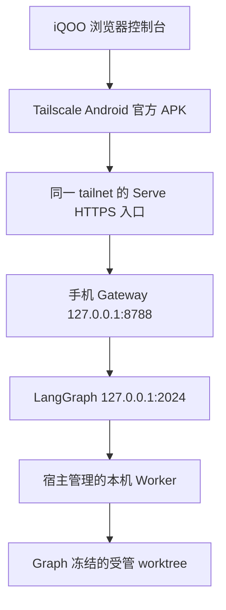

# Agent Hub 手机远程控制实施方案

以一台未获得 Google Play 认证的 iQOO 为目标设备，让用户通过手机流量查看当前托管任务、提交任务提案、处理阻塞决策并继续工作。首版采用移动 Web 控制台，任务执行留在电脑；手机只承担操作与状态展示。

用户已确认需要外网使用。推荐先验证 **Tailscale 官方 Android APK + 手机浏览器 + Tailscale Serve 私网 HTTPS**。这条路线无需自有域名，也不要求安装 ChatGPT 或依赖系统 Google 登录。需要安装的客户端只有 Tailscale；控制台是否能添加到桌面不作为运行前提。没有 Google Play 认证的具体 iQOO 安装与登录能力仍须真机验证。

本文件是实施方案，尚未实现控制 API、手机页面或部署入口。2026 年 10 月 2 日核对时，本机 `http://127.0.0.1:2024/ok` 返回连接拒绝，未确认任何活动 Hub Run。控制对象是 Hub 已登记的项目与 Program、Thread、Task；桌面聊天记录中的任务需要先接入 Hub 才会出现在控制台。

## 当前能力和需要补齐的边界

源码初次核对时 Hub HEAD 为 `cde1adb76ad57d0496d7fb07fed7a0cd4111ca16`，文档校验时并行工作已更新至 `cafc6cc062e59f7b5598af78fed677e8acf7a2e3`，两次均存在未提交改动。以下事实限实际读取的控制入口，不能当作固定提交或手机运行验收。项目身份从 `workspace/projects.json` 解析；本轮读取默认 Forge 的 `workspace/config.json`，未扫描业务仓库或刷新全量注册表。

| 能力 | 当前证据 | 实施要求 |
| --- | --- | --- |
| 项目和运行路径 | `projects/decomposition_config.py` 从项目注册与 workspace 配置解析 | 服务端解析路径，手机仅选择已授权项目 |
| 开发状态读取 | [refactor_dashboard.status](../src/agent_hub/gateway/refactor_dashboard.py#L116) 搜索 Thread 并读取 checkpoint | 提取结构化纯读投影，保留观测时间和证据缺口 |
| 拆解状态读取 | [decomposition.status](../src/agent_hub/gateway/decomposition.py#L334) 可恢复 Thread、保存快照、提交协调 Run | 手机 GET 单独实现；不能直接包装此 CLI 入口 |
| 任务提案 | [decomposition.propose](../src/agent_hub/gateway/decomposition.py#L271) 消费 JSON spec 并提交 PLAN_ONLY Run | 手机表单转为受支持提案；陌生模板返回 NEEDS_SCOPE，禁止落入 adapter 默认分支 |
| 执行与续跑 | [decomposition.run](../src/agent_hub/gateway/decomposition.py#L361) 和 [refactor_run](../src/agent_hub/gateway/refactor_run.py#L43) 已有派发流程 | 提取非阻塞服务；执行须在 Graph 内核对手机确认的精确冻结任务 |
| 阻塞决策 | [refactor_decide](../src/agent_hub/gateway/refactor_decide.py#L9) 与 [decomposition.decide](../src/agent_hub/gateway/decomposition.py#L407) 会提交 Run | 展示该选择会记录、恢复执行或验证集成；不能把所有选择标成无执行影响 |
| Worker 生命周期 | [code_worker](../src/agent_hub/gateway/code_worker.py#L48) 是本机 HTTP Worker，部分启动逻辑在 CLI | 改为宿主服务监管；只绑定 loopback，不对手机直接开放 |
| 拆解执行保护 | 并行工作区的 [ExecutionStore](../src/agent_hub/execution/control.py) 已有文件锁、attempt、generation、合同摘要与持久结果，并接入拆解 Graph 和 Worker | 优先复用；手机授权绑定、跨开发与拆解入口保护及运行有效性仍须核对 |
| 暂停和取消 | 已审查入口没有完整控制合同 | 首版不提供；后续增加派发栅栏、进程登记与停止回执 |

拆解状态的协调路径还可能创建 worktree，或恢复证据判定为 Agent 所有的陈旧改动。因此，“查看进度”必须只读；恢复与协调另设显式命令，展示影响并走 Graph 的既有门禁。

新拆解执行层是其他并行工作产生的未提交变化，本轮只做定向读取，未测试其锁、恢复或运行效果。它采用 OS 文件锁与执行记录，不是已具备续租的服务；Gateway 的用户命令、会话和幂等账本仍需新增，执行锁与执行记录则应复用同一所有者。

## 手机和执行电脑的连接



电脑继续持有项目 checkout、工具链、Codex 与 Git 凭据。Gateway 负责身份、操作合同和展示；Graph 继续拥有生命周期、冻结、ScopeGuard、验证与集成，adapter 继续负责项目事实。

### 首选私网入口

1. 从 [Tailscale 官方 Android 下载入口](https://pkgs.tailscale.com/stable/#android) 安装 APK，核对系统版本满足 Android 8 或更高版本。直接安装的 APK 需要手动更新。
2. 手机与电脑加入同一 tailnet。可使用 [GitHub 或 Microsoft 等身份提供方](https://tailscale.com/docs/integrations/identity)；手机登录流程参照 [Android 安装指南](https://tailscale.com/docs/install/android)。
3. 为执行电脑开启 MagicDNS 和 HTTPS Certificates，将访问权限限制到用户本人及执行电脑。证书机器名与 tailnet DNS 名会进入公开证书透明度记录，机器采用中性名称。[HTTPS 配置前提](https://tailscale.com/docs/how-to/set-up-https-certificates)
4. Gateway 实现并启动后，在电脑配置 Serve。以下是后续部署命令，本轮未执行：

   ```sh
   tailscale serve --bg --https=443 http://127.0.0.1:8788
   tailscale serve status
   ```

   手机使用 Serve 返回的 `https://<机器名>.<tailnet>.ts.net` 地址。`--bg` 保存入口配置，可随 Tailscale 重启恢复；应用进程本身仍需单独监管。[Serve 命令](https://tailscale.com/docs/reference/tailscale-cli/serve)

5. 先提供受保护的只读健康页；关闭手机 Wi-Fi，验证蜂窝访问后再接入任务写操作。

Android 同一用户或 profile 只能有一个活动 VPN；已有代理或防广告 App 若使用 VPN，会与 Tailscale 冲突。[Android VPN 约束](https://developer.android.com/develop/connectivity/vpn)、[Tailscale 共存说明](https://tailscale.com/docs/reference/faq/other-vpns)。锁屏后的网络恢复、电池限制和后台运行必须在实际 iQOO 上操作验收，不预设 OriginOS 菜单位置。此方案的 HTTPS 入口仅向 tailnet 开放。

### 无手机 VPN 的备选入口

如首选方案未通过手机先行验证，采用“手机浏览器 → Cloudflare Access 邮箱验证码 → Tunnel → 同一 Gateway”。需要 Cloudflare 账户、Cloudflare 管理的域名、电脑持续运行的 `cloudflared`，以及可达 Cloudflare 的出站网络。[Tunnel 前提](https://developers.cloudflare.com/tunnel/get-started/)、[7844 出站要求](https://developers.cloudflare.com/cloudflare-one/networks/connectors/cloudflare-tunnel/configure-tunnels/tunnel-with-firewall/)

Access 只允许指定邮箱，通过一次性验证码登录，验证码有效期为 10 分钟。[邮箱验证码](https://developers.cloudflare.com/cloudflare-one/integrations/identity-providers/one-time-pin/) Gateway 校验 Access JWT 的签名、有效期、issuer 与 audience，不能只信任转发邮箱头。[JWT 验证](https://developers.cloudflare.com/cloudflare-one/access-controls/applications/http-apps/authorization-cookie/validating-json/)

域名、账户权限和运营商可达性当前未知。此备选只有通过蜂窝实测后才可报告可用；临时 Quick Tunnel 的可用性和功能限制不适合作为长期控制入口。[Quick Tunnel 限制](https://developers.cloudflare.com/tunnel/get-started/quick-tunnels/)

## 首版操作流程

| 页面 | 用户看到和能够操作的内容 |
| --- | --- |
| 工作列表 | 已授权项目、现有 Program、当前任务、运行或阻塞状态；明确选择正在进行的工作 |
| 任务详情 | 任务目的、进度、有限日志、验证与集成结果、最近更新时间、连接状态 |
| 提交任务 | 项目、受支持模板、标题、需求描述、目标单元和验收描述；先产生提案与冻结预览 |
| 待处理决策 | 当前阻塞原因、有效选择、选择会产生的影响；核对后提交或继续 |

“发布任务”表示提交提案或派发任务。首版开放已支持模板与已有冻结任务；自由文本可保存为需求草稿，但未完成范围解析时显示 NEEDS_SCOPE，不能承诺自动执行任意需求。验收描述也不能直接成为手机指定的 Shell 命令。

执行按钮应绑定用户看到的具体任务、基线与范围；冻结任务变化后要求重新查看。当前拆解 CLI 由 Graph 自选 READY 任务，需增加 Graph 内的绑定校验，不能只在 Gateway 请求前检查一次。

首版轮询建议为页面前台每 3 秒一次，异常时退避至 10 至 30 秒；这是待实测的配置。切后台时停止页面轮询，重新打开立即按 Program 和 Command ID 回读。手机断线只更新连接状态，不能将执行任务改成已停止。首版运行不依赖推送、后台常驻网页或添加桌面快捷方式。

## 服务端控制合同

建议新增小型 FastAPI Gateway，使用 Uvicorn 运行、SQLite 保存命令账本和会话。Gateway 与手机页面同源，API 位于 `/control/v1`；这些模块与接口目前均未实现。

| 接口 | 合同 |
| --- | --- |
| `GET /control/v1/health` | 已登录用户读取 Hub、Worker 和入口健康；不启动进程 |
| `GET /control/v1/projects` | 读取授权项目登记；不扫描源码 |
| `GET /control/v1/programs?project_id=…` | 读取现有 Program 和 Thread；不自动创建或恢复 |
| `GET /control/v1/programs/{id}` | 纯读当前任务、决策、日志尾部与证据投影 |
| `POST /control/v1/proposals` | 保存草稿或提交受支持模板的 PLAN_ONLY 提案 |
| `POST /control/v1/programs/{id}/commands` | 显式 `execute`、`decide`；恢复和协调以独立操作权限处理 |
| `GET /control/v1/commands/{id}` | 回读持久化命令结果与关联 Run，无隐式重试 |

身份先受 tailnet 权限约束，控制台再通过电脑生成的一次性配对凭据建立可撤销会话。凭据有有效期、限速与单次消费，会话使用 Secure、HttpOnly、SameSite Cookie；写请求校验来源与 CSRF。配对、撤销和具体会话期限在实现时固定并测试。Cloudflare 备选沿用相同应用会话合同。

服务端从注册表核对 `project_id → program_id → thread_id → repository_id`，已有多个 Thread 时不静默附着到错误程序。首版写操作仅开放已核对配置与模板的项目；FlutterGuard 保持 PLAN_ONLY，其执行迁移需另行冻结范围。手机不能指定本机路径、Worker endpoint、Graph 名、任意命令或 Graph 自有的 allowed/candidate paths。业务 Git 与模型凭据留在电脑，返回日志须限长并过滤密钥。

写命令必须满足以下约束：

- **精确授权**：执行绑定 `task_id`、完整冻结合同 hash、每个可写仓库的基线 revision、checkpoint 版本和用户确认；服务端计算权限，Graph 在实际选任务、派发与集成临界区核对合同及执行身份。
- **异步回执**：先持久化 Command，再返回 `202 + command_id`；后台派发并登记 thread/run/worker execution ID。响应中的“已接收”不表示任务已执行成功。
- **幂等与未知结果**：同一身份、项目、幂等键与内容只接受一次，键相同但内容不同返回冲突。派发超时或进程崩溃后以命令关联元数据回查；无法证明是否已提交时保留 DISPATCH_UNKNOWN，不自动再次派发。
- **并发控制**：现有 `multitask_strategy=reject` 只保护同一 Thread。统一 CLI 与手机的 Program 绑定，优先复用拆解层的文件锁和 generation，并核对开发与拆解入口是否共同保护同一仓库或 worktree。旧执行者失权后不得派发或集成；若后续改用可过期租约，需续租且过期不能被当作 Worker 已停止，不据此自动重发。
- **决策影响**：决策绑定当前 decision ID、版本及效果。若选择可能执行、恢复或集成，必须绑定相应冻结合同与授权；“仅记录选择”需新增独立能力，不能直接复用当前 decision Run。

投影至少携带 `observed_at`、连接状态、project/program/thread/run/task ID、原始任务状态、日志尾部和证据来源。EXECUTED、VALIDATED、INTEGRATED、PLATFORM_ACCEPTED 分别展示；缺少证据或未绑定当前版本时保留 PENDING 或 UNKNOWN。现有 [完成状态校验文档](completion-evidence-contract.md) 描述独立试点，并行拆解 Graph 又出现新的完成校验；两者关系需在实施时核对。本方案不声明任何完成门禁已通过运行验收。

## 电脑部署和恢复

首版部署为三个受监管的服务：LangGraph、手机 Gateway、项目执行 Worker；Tailscale Serve 是独立网络入口。macOS 采用用户级 launchd，运行路径、venv、环境配置和日志位置均固定。Gateway 的命令账本建议放在 Hub 的 `.control/` 运行目录并排除提交。用户级服务的重启恢复前提是已登录执行用户；开机未登录时可用需另设系统服务与凭据合同。

需统一现有 Worker 端口配置：refactor 客户端默认 endpoint 为 `8765`，decomposition 客户端为 `8766`，Worker 独立入口默认端口为 `8787`。最终配置由宿主显式提供，Gateway 不接受手机覆盖。端口数字本身不是协议合同。

电脑锁屏后任务应继续；系统睡眠、关机或网络断开会影响可达性，手机须显示离线。重启并登录执行用户后先只读回查并分类：已完成任务读回结果；Worker 存活或归属不明时先阻塞，未知执行不能重发；部分改动保留后，通过显式命令交由 Graph 判断恢复或协调。重启恢复不等于恢复原有 Codex 进程。

个人试用可继续使用当前 `langgraph dev`，但它属于开发服务，持久化和恢复范围需验证。长期运行前单独评估生产部署及 PostgreSQL、Redis 和许可条件，不默认把启动 `langgraph up` 视为零配置的免费生产方案。[LangGraph 本地开发与生产环境验证](https://docs.langchain.com/langsmith/local-dev-testing)

## 实施顺序和交付门槛

| 阶段 | 交付 | 完成门槛 |
| --- | --- | --- |
| P0 手机连通先行 | Tailscale APK、电脑入口、受保护健康页 | iQOO 安装登录，关闭 Wi-Fi 后访问 HTTPS；核对 VPN 冲突与后台恢复。失败则验证 Cloudflare 备选 |
| P1 当前任务可见 | 常驻服务、纯读 API、工作列表和详情 | 能附着正确已有 Program；重复 GET 不提交 Run、不写快照、不修改业务工作树 |
| P2 工作可控制 | 提案表单、冻结预览、执行和决策命令、账本与执行租约 | 有效任务在手机操作后实际执行；陈旧授权、重复点击、跨项目访问和并发冲突被正确处理 |
| P3 可恢复与真机验收 | 断网恢复、服务重启协调、证据记录 | iQOO 完成端到端操作与结果回读；电脑重启并登录执行用户后恢复；错误和未知状态均可见 |
| 后续可选 | 独立 APK、通知、暂停和取消 | 有明确需要后实施；停止合同需覆盖派发栅栏、进程组停止、残余 diff 与恢复 |

新增范围建议为 `gateway/mobile_control`、共享非阻塞 Program 控制服务、移动静态页面、Graph 和 Worker 的手机授权绑定及现有执行保护的扩展、启动脚本和定向 fixture。保持各业务 checkout、namespace 和 adapter 所有权；方案制定阶段不修改它们。

测试先使用临时仓库与模拟 Agent Server。纯读测试将 mutation 请求、walk/glob/rglob 设为报错；另覆盖幂等键冲突、超时后结果未知、版本变化、跨项目 Thread、执行绑定和共享资源并发。既有 gateway 测试只选关联 fixture，避免真实 Forge checkout 用例触发无关读取。文档变更本身不运行业务构建或平台测试。

## iQOO 验收清单

| 操作 | 必需证据 |
| --- | --- |
| 安装与登录 Tailscale | 手机实机操作记录、系统版本、APK 版本及下载来源；失败保留错误 |
| 手机流量访问 | Wi-Fi 已关闭的操作记录、HTTPS 页面与认证后的健康回读 |
| 查看当前工作 | 手机所选 Program、Thread、Run 与宿主回读一致；刷新前后证明没有新 Run 或改动 |
| 提交并执行任务 | 手机提案和冻结确认、Command/Run ID、Worker 结果、实际 diff 与验证回执；初次使用临时受管 fixture 项目 |
| 处理阻塞决策 | 手机显示有效选择和影响，提交后状态与后端实际行为一致 |
| 重复点击与断网 | 一次操作只产生一个有效命令；断网重连后回到同一 Command/Run，未知派发不重发 |
| 锁屏与切后台 | 手机锁屏期间宿主继续工作，重新打开后正确回读；电脑锁屏期间保持服务可用 |
| 电脑重启并登录执行用户 | 服务与入口恢复，旧结果可读，未完成执行分类为可恢复或待协调，未产生重复 Worker |
| 权限和版本冲突 | 未授权身份无法写；旧合同或错误项目操作被拒绝且页面解释可见 |

证据记录需绑定 Gateway 代码版本、冻结合同、产物或输出树、设备与网络环境。前端渲染、fixture 测试或电脑构建不能替代 iQOO 真机和蜂窝验收。

当前状态：**方案与源码核对已完成；API、页面、常驻部署、远程入口和 iQOO 验收均为 PENDING。** 下一项工作从 P0 连通验证开始，随后进入 P1；本轮未启动服务、派发业务任务、提交、推送或发布。
